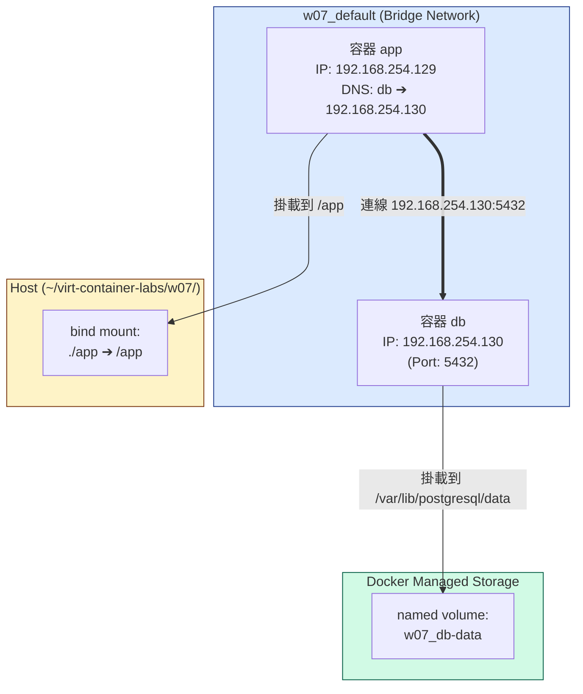

# W07｜Docker Compose 與資料持久化

## 拓樸圖

## 從 docker run 到 compose.yaml
- 以前用 docker run 時，必須先手動建立網路，還要把每個容器用 --network 連進去，甚至得死記容器的 IP 或手動設定 --link。只要漏掉一個步驟，或是容器重啟後 IP 改變，整個服務就直接斷線。
- 改用 `compose.yaml` 的宣告式管理後，只要定義好 services，Compose 就會自動幫我們拉起一個專屬的 default 網路。最棒的是，服務名稱直接就是 DNS 名稱，在 app 裡面只要指定 DB_HOST=db 就能完美互通。這把原本散落、依賴人工記憶的命令式指令，變成了一份隨插即用且能直接進 Git 版控的資產。  

## 三種掛載對照
| 掛載類型 | 路徑（host） | 容器砍重起資料還在嗎 | 重啟容器資料狀態 | 適合情境 |
|---|---|---|---|---|
| named volume | `/var/lib/docker/volumes/w07_db-data/_data` | 在 | 資料完整保留，新容器能直接讀取舊資料 | 生產環境的資料庫儲存、需要跨容器共享或持久化重要資料時 |
| bind mount | `~/virt-container-labs/w07/app` | 在 | 資料即時同步，Host 端的修改會立刻反映在容器內 | 本地開發與除錯。例如即時修改原始碼，不需重新 build image 即可看到變更 |
| tmpfs | `X (存在記憶體中)` | 不在 | 恢復到初始的空目錄狀態 | 敏感暫存資料或需要極高讀寫速度的快取 |

## healthcheck 前後對照
| 寫法 | curl /healthz t=1s | t=3s | t=5s | t=10s |
|---|---|---|---|---|
| 只 depends_on | 503 | 503 | 503 | 200 |
| service_healthy | `refused` | `refused` | `refused` | 200 |

**觀察:**
- 只使用 `depends_on`：當 db 容器一啟動，app 容器就會立刻被拉起來。但此時 Postgres 還在進行內部的初始化與資料庫建立，根本還沒準備好接受連線。這導致 app 在前幾秒去敲資料庫時，會狂吃 `connection refused` 或者是我們 Flask App 寫好的 503 db unreachable 錯誤訊息。
- 使用 service_healthy：app 容器會保持在阻塞狀態，直到 db 的 healthcheck 回傳 healthy 為止。因此在 t=1s 到 t=5s 之間，因為 app 根本還沒被建立起來，所以埠口 8080 沒有任何程式在監聽，curl 會直接拿到 `Connection refused` 。不過，一旦 app 真正啟動成功，就代表資料庫已經就緒，第一發進去的 HTTP 請求就能完美拿到 200 ok，成功消除了服務啟動時的錯誤過渡期與 Log 噪音。 

## 排錯紀錄
- 症狀：執行 docker compose up -d 後，透過 `curl http://localhost:8080/healthz` 測試一直回傳 503 `db unreachable: could not translate host name "db" to address: Name or service not known`。
- 診斷：查看 app 容器的環境變數與 compose.yaml。發現自己在調整測試時，把 services 下的資料庫名稱改成了 database:，但是 app 環境變數中的 DB_HOST 卻依然寫著 db。由於 Compose 的服務發現是建立在 service name 上，當 service name 改變，原本的 DNS 紀錄就會失效，導致 app 無法解析 db 這個主機名稱。
- 修正：將 compose.yaml 檔案中資料庫的服務名稱重新修正回 db:，確保與 app 內部環境變數 DB_HOST: db 的命名完全一致。
- 驗證：重新執行 docker compose up -d 讓變更生效，等待數秒後再次執行 `curl http://localhost:8080/healthz`，順利拿到 200 ok 且能正確撈出資料庫時間。  

## 設計決策
**Q: 為什麼 db 用 named volume 而不是 bind mount？**
- 權限與相容性問題：Postgres 等專業資料庫在執行時，對資料目錄的檔案擁有者、權限以及底層檔案系統鎖定機制有非常嚴格的要求。如果使用 bind mount，會直接將 Host 端的 UID/GID 與檔案權限帶入容器，經常在跨平台或宿主機權限限制下，導致資料庫因為權限不符而崩潰。
- 生命週期管理：Named volume 是由 Docker Engine 完全託管的獨立區塊。我們不需要、也不應該知道 Postgres 在底層是怎麼拆解檔案的。交給 Docker 託管不僅能確保最高效能，也能避免開發人員在 Host 端不小心手動誤刪或修改到資料庫的內部檔案，確保資料的高可用與安全。

**Q: 為什麼不能在生產用 tmpfs 存資料庫？**
- 資料無法持久化：tmpfs 的本質是將資料完全儲存在「記憶體」中，它不具備任何持久化能力。在生產環境中，容器可能因為非預期錯誤崩潰、主機重啟、或者在進行日常版本升級時被重新建立。一旦容器生命週期結束，tmpfs 裡的所有資料會被徹底抹除、付之一炬，這對於需要絕對穩定與資料持久的資料庫來說是不可容忍的災難。  